# Real-time License Plate Recognition

## 1.	Introduction/ Background

### Introduction: 
Cars play a vital role in daily life, with license plates essential for regulation and traffic management. As vehicle numbers grow, the need for automated license plate recognition increases. Automatic Number Plate Recognition (ANPR) enhances traffic control, safety, and applications like toll collection and law enforcement [1].  
### Dataset Description: 
Our project will use You Only Look Once (YOLO) for detection and recognition. The datasets consist of 10,000+ US license plate images, providing a solid foundation for developing and evaluating our ANPR model.
### Dataset Link:   
https://www.kaggle.com/datasets/gpiosenka/us-license-plates-image-classification
https://www.kaggle.com/datasets/andrewmvd/car-plate-detection 

## 2.	Problem Definition
### Problems & Modivations:
  Manual license plate recognition is a time-consuming process and often makes errors, especially in high-traffic environments. For example, toll roads, parking lots, and security checkpoints. With the increasing number of vehicles on the road, an automated and accurate license plate recognition system is necessary to improve traffic management efficiency. Vehicle owners no longer need to have the anxiety of losing a parking ticket or forgetting to turn on their EZ-Pass. Law enforcement agencies can identify suspicious vehicles and take actions much faster. By using ML and CV techniques, our system aims to provide an accuracy and real time solution for automated license plate recognition.

## 3.	Pipeline & Tech Stack
### Object Detection: 
✅YOLOv8: It is a combination of supervised and unsupervised learning methods.   
Since we have labeled datasets containing images and their corresponding license plate values, we will use a Supervised Learning approach. The model is also chosen for its **efficiency and real-time object detection capabilities**  

Evaluation Metrics:
  - Accuracy, Precision, Recall, Confidence Threshold
  - Chose these of the desire to detect all true plates, and readability

### Data Preprocessing:
✅Crop  
✅DPI  
✅Grayscale  
✅Increase Contrast  
✅Morphological  

- Flow：Crops the plates out -> Check Image DPI -> Greyscales the Image -> Enhance Contrast -> Mophological Closing

The image is first **cropped** using plate boundaries detected by the YOLOv8 model.
After **checking image DPI**, it is then **converted to grayscale, contrast-enhanced**, and **refined using morphological closing** to improve text clarity and OCR accuracy.  

   

<em>
These are examples of correctly recognized results after preprocessing and hybrid OCR detection.
</em>

Checking DPI helps us filter out low-quality images that are likely to cause OCR errors. Images with very low DPI often contain blurred or pixelated text, leading to misrecognition. By analyzing prediction accuracy across DPI values, we found that images below 14 DPI significantly reduce OCR performance.

**Therefore, we apply a DPI threshold at 14.00 to**

- Exclude poor-quality inputs before OCR processing
- Improve overall OCR accuracy by focusing on sufficiently sharp images
- Balance precision and recall, minimizing false negatives without sacrificing too many true positives

### Text Detection：
✅EasyOCR  
✅Google Cloud Vision    
We utilized both EasyOCR and Google Cloud Vision for text detection. Since Google Cloud Vision incurs cost, and EasyOCR may perform poorly on low-confidence predictions, we applied a cost-effective yet reliable hybrid approach.

- We use EasyOCR as the primary OCR engine.If the confidence score is below 0.93, we fallback to Google Cloud Vision for that specific sample.

This method allows us to **balance accuracy and budget**, maintaining high performance while minimizing API expenses.

### ML Algorithms/Models Used:
✅YOLOv8: It is a fast and efficient deep learning model that provides real-time object detection with high accuracy. It is a combination of supervised and unsupervised learning methods. It’s our main model for this project.

✅Google Cloud Vision: We apply a hybrid OCR pipeline using EasyOCR as the primary engine.If the EasyOCR confidence score is below 0.93, we fallback to Google Cloud Vision for that sample. This ensures that only high-confidence predictions are accepted directly, and uncertain predictions are re-evaluated using a more robust alternative.

✅EasyOCR: EasyOCR is a powerful, ready-to-use Python library that enables fast and accurate optical character recognition (OCR) across multiple languages with minimal setup. EasyOCR's confidence scores are strong indicators of prediction reliability. By applying a threshold of 0.93, we know the precision of the system. This threshold serves as a confidence-based filter to select only trustworthy OCR outputs.

## 4. Discussion
✅ Accuracy: Correct Predictions/Total Predictions  
✅ Precision: True Positives/TruePositives+FalsePositives  
✅ Recall: True Positives/TruePoitives+FalseNegatives  

The 3 metrics above are used to compute how accurate the model is at detecting characters on the license plates.

✅ Detection Error Tradeoff: Used to optimize the threshold by filtering false positives to help reduce misclassification of license plate characters and recognizing license plates.

Our goal in this project is to create a model with high accuracy, precision, and recall while trying to optimize thresholds with the detection error tradeoff. Hopefully this will help us balance the false positives as well as the false negatives. Using models such as YOLO are energy efficient and work in real-time, and optimizing such models further could help with sustainability. Our expected result is reaching a 99% success rate of detection, and a precision rate of over 95% for true positives.

### Discuss the results of your methods and present visualizations and quantitative scoring metrics. What does your visualization/metric tell you? Why did your model perform well/poorly? What are the next steps you plan to take?

  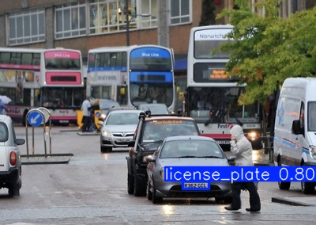

<em>
Our model successfully detected some licence plates but failed to detect some others, resulting in both True Positive and False Negative.  
</em>

**Quantitative Scoring Metrics:**

  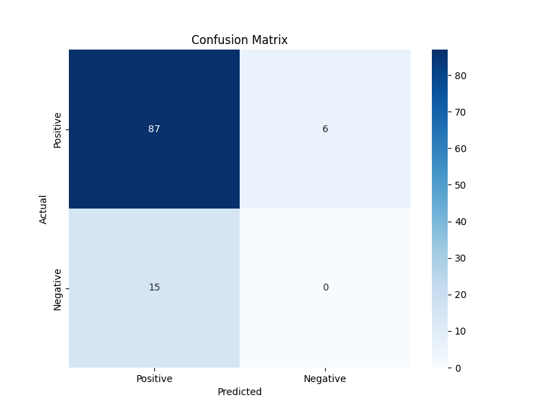

<em>
Our model correctly identified 87 positive cases, incorrectly predicted 6 (false negatives), and missed 15 false positives, with no true negatives recorded as this is not applicable. We get a total accuracy rate of 80.6% and shows a relatively reliable performance of our model.  
</em>

## 5. Results 
#### Hybrid OCR Pipeline Results
**--- DPI Threshold Analysis ---**  
Total images analyzed: 472  
OCR-Ready=TRUE images: 260  
OCR-Ready=FALSE images: 212  

Optimal DPI Threshold: 14.00  
Accuracy: 0.8644  
Precision: 0.9495  
Recall: 0.7962  
F1 Score: 0.8661  

  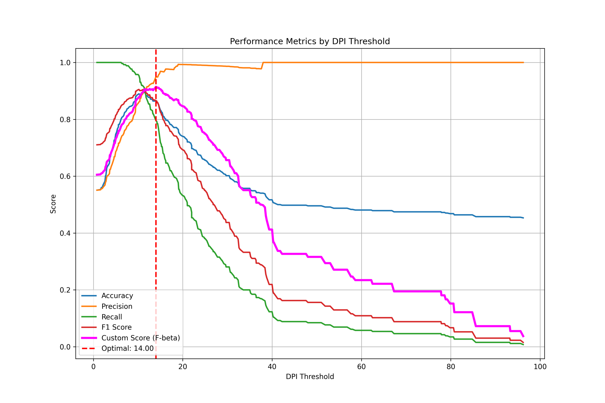
  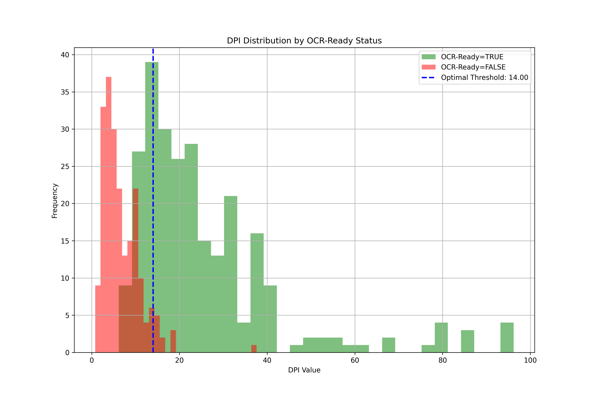
  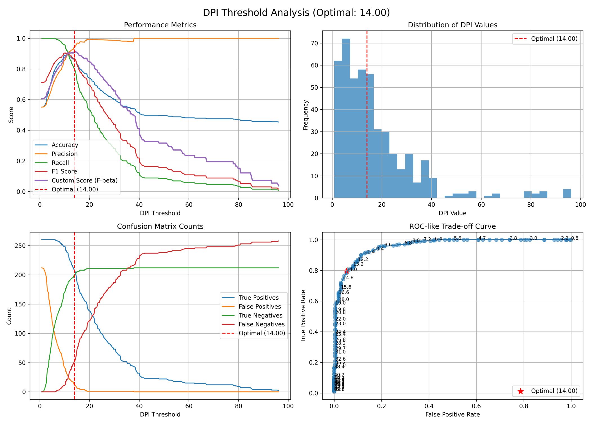

**--- Overall OCR Performance ---**  
Total OCR results: 45  
Correct results: 42 (93.3%)  
Incorrect results: 3 (6.7%)  
Overall accuracy: 93.33%  

  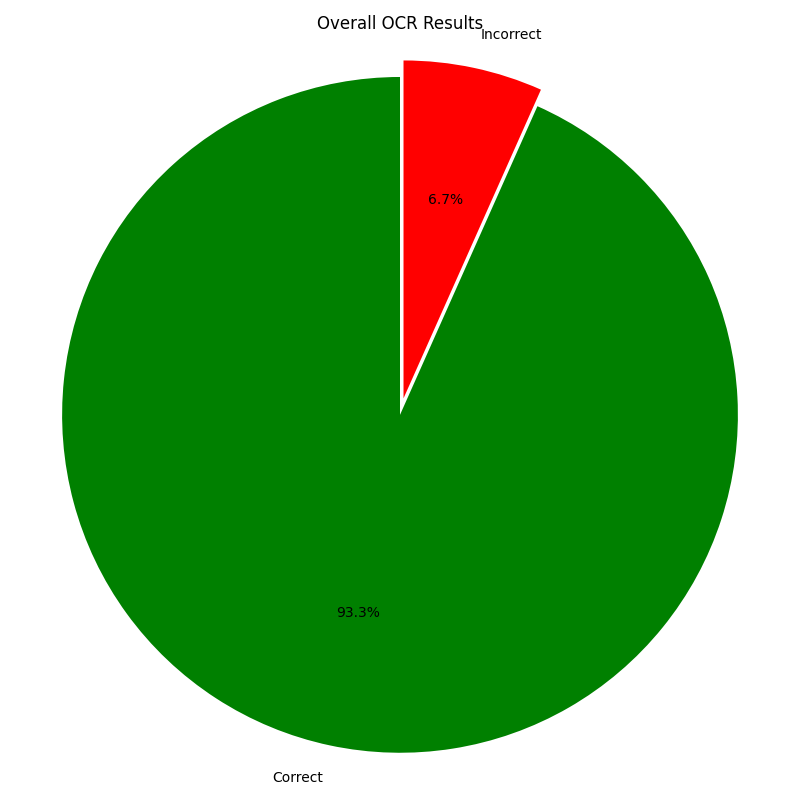
  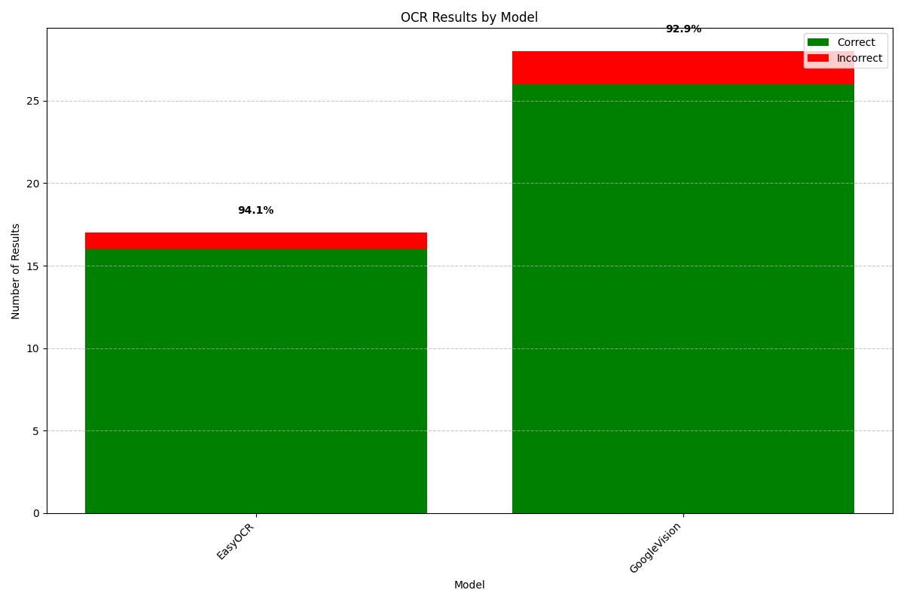

**--- OCR Performance by Model ---**  
Model: GoogleVision  
Total results: 28.0  
Correct: 26.0 (92.9%)  
Incorrect: 2.0 (7.1%)  
Accuracy: 92.86%  

Model: EasyOCR  
Total results: 17.0  
Correct: 16.0 (94.1%)  
Incorrect: 1.0 (5.9%)  
Accuracy: 94.12%  

  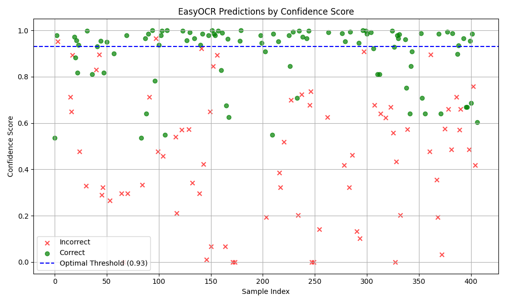
  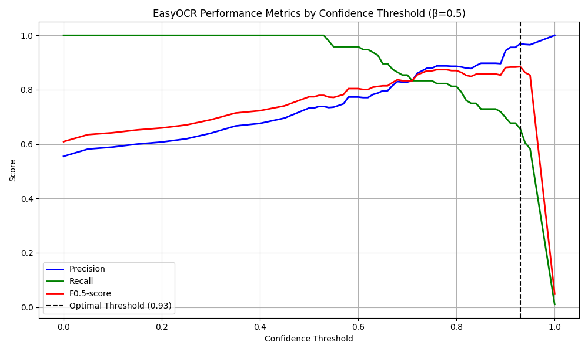
  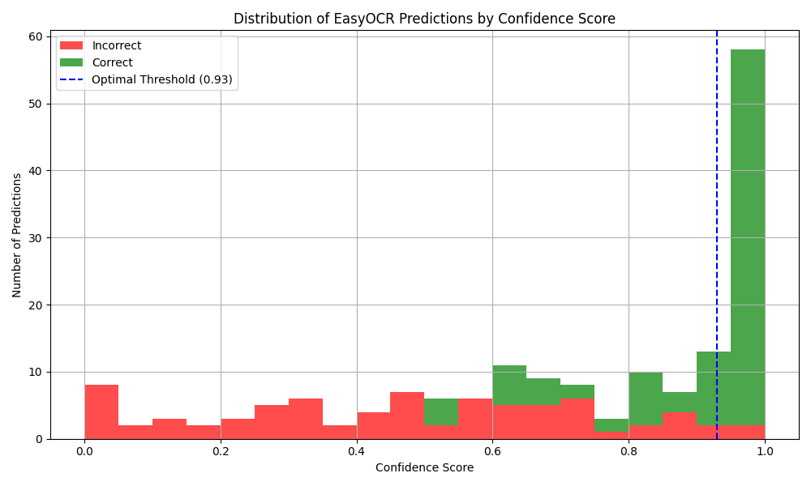

**Precision**: 0.9355  
**Final Recall**: 0.8529  
**F1 Score**: 0.8923  
**Total Ground Truth**: 102  
**Total Predictions**: 93  
**True Positives (TP)**: correctly detected license plates  
**False Positives (FP)**: incorrect detections  
**False Negatives (FN)**: missed license plates  
**True Negatives (TN)**: not applicable in object detection  
**True Positives**: 87  
**False Positives**: 6  
**False Negatives**: 15  

## 6. Conclusions
- Our model correctly identified 87 positive cases, incorrectly predicted 6 (false negatives), and missed 15 false positives, with no true negatives as this is not applicable. We get a total accuracy rate of 80.6% and shows a relatively reliable performance of our model.

  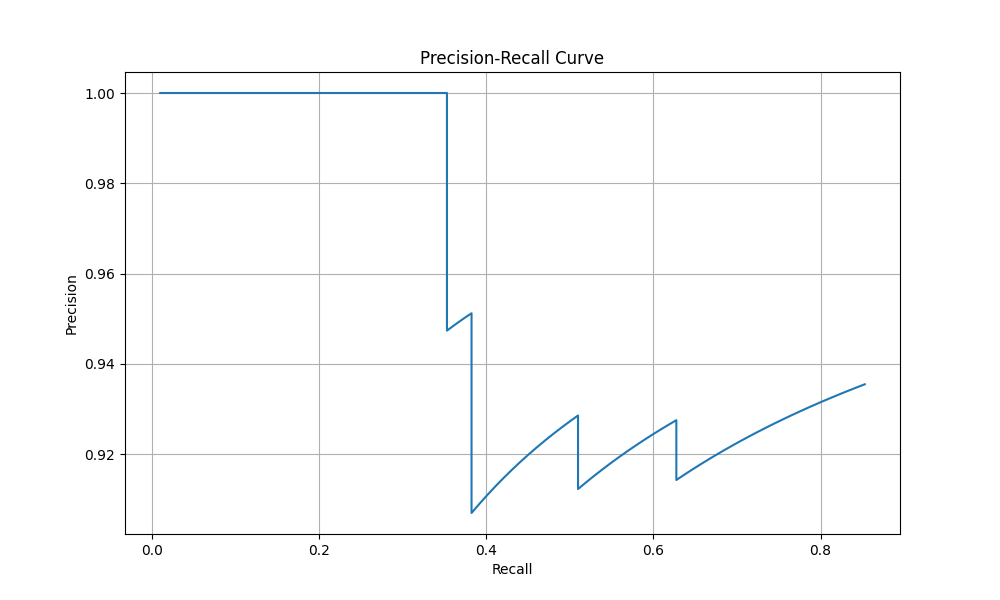

- Our YOLOv8 model performed generally well with high precision, however there were still some false positive and negative cases. The false negatives cases when some plates were missed could be due to poor image quality or issues with angles or lighting. The false positives suggest that some objects other than license plates were mistaken as plates, which could be due to background noises or these objects looking too similar. 
We have incorporated OCR to read and validate detected plates. This helps to verify true positives and reduce false positives as it checks if the detected regions contains valid text.

- We have incorporated OCR to read and validate detected plates. This helps to verify true positives and reduce false positives as it checks if the detected regions contains valid text.

## 7. Reflections

**Limitations and Tradeoffs**
- DPI threshold could block out some plates that could be read
- High confidence level requirement requires more Google OCR
- Use of Google Cloud OCR makes the model more expensive
- Accurate model at the cost of better OCR methods

**Next Steps**
- Create a OCR ourselves
- Optimize YOLO Model to reduce distractions
- Incorporate license plate formats into detection logic

## 8.	References
[1] R. K. Prajapati, Y. Bhardwaj, R. K. Jain, and K. K. Hiran, “A Review Paper on Automatic Number Plate Recognition using Machine Learning: An In-Depth Analysis of Machine Learning Techniques in Automatic Number Plate Recognition: Opportunities and Limitations,” 2023 International Conference on Computational Intelligence, Communication Technology and Networking (CICTN), Ghaziabad, India, Apr. 2023, pp. 1-6, doi: 10.1109/CICTN57981.2023.10141318.  
[2] Y. Wang, Z.-P. Bian, Y. Zhou, and L.-P. Chau, “Rethinking and Designing a High-performing Automatic License Plate Recognition Approach,” arXiv, 30 Nov. 2020, [Online]. Available: https://arxiv.org/abs/2011.14936. [Accessed: 21 Feb. 2025].  
[3] H. Saghaei, “Proposal for Automatic License and Number Plate Recognition System for Vehicle Identification,” arXiv, 9 Oct. 2016, [Online]. Available: https://arxiv.org/abs/1610.03341. [Accessed: 21 Feb. 2025].  

## Proposal Contribution Table
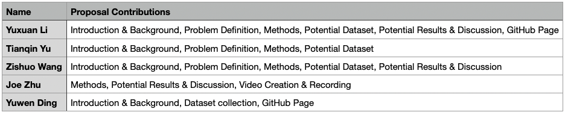

## Midterm Contribution Table
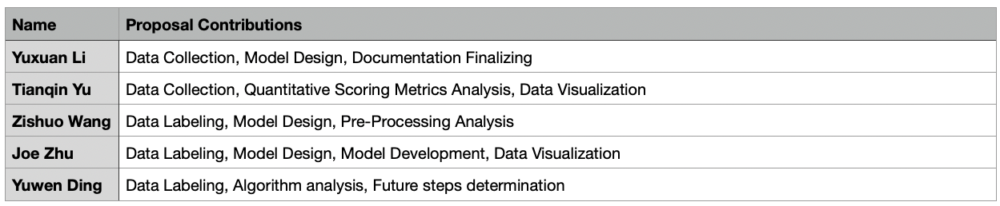

## Final Contribution Table
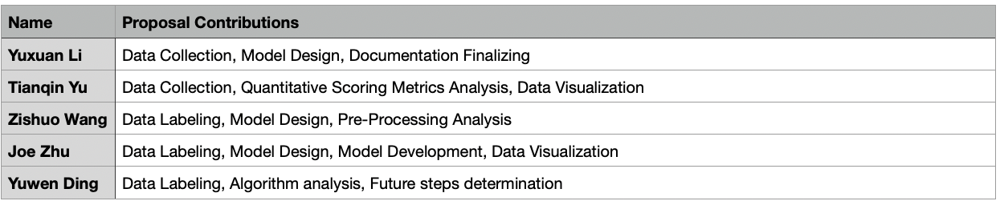
 

